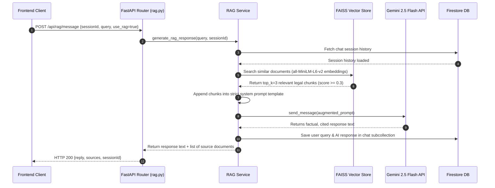

# DESIGN AND IMPLEMENTATION OF AN AI-POWERED LEGAL ASSISTANCE SYSTEM USING RETRIEVAL-AUGMENTED GENERATION (RAG)

---

## TABLE OF CONTENTS

- **CHAPTER ONE: INTRODUCTION**
  - 1.1 Background of the Study
  - 1.2 Problem Statement
  - 1.3 Research Questions
  - 1.4 Objectives of the Study
    - 1.4.1 General Objective
    - 1.4.2 Specific Objectives
  - 1.5 Rationale of the Study
    - 1.5.1 Justification
    - 1.5.2 Significance of the Study
  - 1.6 Scope and Limitations
    - 1.6.1 Scope
  - 1.7 Limitations
- **CHAPTER TWO: LITERATURE REVIEW**
  - 2.1 Introduction
  - 2.2 Conceptual Review
    - 2.2.1 Artificial Intelligence in Legal Systems
    - 2.2.2 Natural Language Processing and Large Language Models
    - 2.2.3 Retrieval-Augmented Generation
  - 2.3 Digital Legal Information Systems
  - 2.4 Review of Existing Systems
    - 2.4.1 DoNotPay
    - 2.4.2 ROSS Intelligence
    - 2.4.3 ChatGPT in Legal Assistance
  - 2.5 Identified Research Gaps
  - 2.6 Summary
- **CHAPTER THREE: SYSTEM ANALYSIS AND DESIGN**
  - 3.1 Introduction
  - 3.2 Requirement Analysis
    - 3.2.1 Functional Requirements
    - 3.2.2 Non-Functional Requirements
  - 3.3 System Analysis (Modeling)
    - 3.3.1 Use Case Analysis
    - 3.3.2 Process Modeling
  - 3.4 Proposed System Architecture
    - 3.4.1 High-Level Architecture
    - 3.4.2 The RAG Pipeline Design
  - 3.5 Database Design
    - 3.5.1 Relational Database Schema
    - 3.5.2 Vector Database Design
  - 3.6 User Interface (UI) Design
- **CHAPTER FOUR: IMPLEMENTATION AND TESTING**
  - 4.1 Introduction
  - 4.2 Implementation Environment
    - 4.2.1 Hardware Requirements
    - 4.2.2 Software Requirements (The Tech Stack)
  - 4.3 System Development Process
    - 4.3.1 Data Collection and Pre-processing
    - 4.3.2 Implementation of the RAG Pipeline
    - 4.3.3 Developing the Feature Modules
  - 4.4 System Testing and Evaluation
    - 4.4.1 Unit and Integration Testing
    - 4.4.2 Accuracy Evaluation (RAG vs. Standalone LLM)
    - 4.4.3 User Acceptance Testing (UAT)
  - 4.5 System Screenshots
- **CHAPTER FIVE: CONCLUSION AND RECOMMENDATIONS**
  - 5.1 Summary of Work
  - 5.2 Achievement of Objectives
  - 5.3 Contribution to Knowledge
  - 5.4 Challenges Encountered
  - 5.5 Limitations of the Final System
  - 5.6 Future Recommendations
- **REFERENCES**
- **APPENDIX A: PROPOSED EVALUATION METRICS**
- **APPENDIX B: ETHICAL CONSIDERATIONS**

---

# CHAPTER ONE: INTRODUCTION

## 1.1 Background of the Study

Access to legal information is essential for the protection of individual rights and the promotion of justice in any society (World Justice Project, 2023). However, in many developing countries, including Cameroon, access to reliable and understandable legal assistance remains a significant challenge. According to the World Bank (2022), approximately 5.1 billion people worldwide lack meaningful access to justice, with developing nations disproportionately affected. Legal systems are often complex and characterized by technical language, making it difficult for ordinary citizens to interpret laws and procedures (Access to Justice Foundation, 2021).

Traditionally, individuals rely on legal practitioners for guidance. However, the high cost of legal services, limited availability of professionals in rural areas, and low levels of legal literacy restrict access to justice for many people (Nam & Wexler, 2020). In Cameroon specifically, the ratio of lawyers to citizens is approximately 1:10,000, with most practitioners concentrated in urban centers (Cameroon Bar Association, 2023). Additionally, existing digital legal resources are often fragmented, difficult to navigate, and not tailored to non-expert users (Chalkidis et al., 2021).

Recent advancements in Artificial Intelligence (AI), particularly in Natural Language Processing (NLP) and Large Language Models (LLMs), have created new opportunities to improve access to legal information (Bombieri et al., 2023). These technologies enable systems to interpret user queries and generate human-like responses. However, standalone AI systems may produce inaccurate or misleading information due to lack of grounding in verified legal sources (Ji et al., 2023).

To address this limitation, Retrieval-Augmented Generation (RAG) has emerged as a promising approach that combines information retrieval with generative AI (Lewis et al., 2020). By retrieving relevant legal documents and using them to guide response generation, RAG-based systems improve the accuracy, reliability, and contextual relevance of AI-generated answers (Gao et al., 2023).

This study proposes the design and implementation of an AI-powered legal assistance system that leverages RAG techniques to provide accurate, accessible, and user-friendly legal information. The system also incorporates case reporting and lawyer discovery features to enhance usability and support broader legal access.

## 1.2 Problem Statement

Despite the importance of legal awareness, many individuals lack access to reliable and affordable legal assistance. Legal information is often scattered across multiple sources and presented in complex language that is difficult for non-experts to understand (Katz et al., 2022). This creates barriers that prevent individuals from effectively exercising their rights.

Furthermore, traditional legal consultation processes are often time-consuming and expensive, making them inaccessible to a large portion of the population. In sub-Saharan Africa, legal consultation fees can exceed 30% of monthly household income for low-income families (UNDP, 2022). Although some digital solutions exist, they often lack interactivity, personalization, and real-time assistance (Surden, 2021).

In addition, there is a lack of systems that allow users to securely report legal issues or easily connect with legal professionals. This disconnect between individuals and legal services further limits access to justice (Hynes et al., 2020).

Therefore, there is a need for an intelligent, accessible, and user-friendly system that can provide instant legal guidance, simplify complex legal information, and facilitate interaction between users and legal professionals.

## 1.3 Research Questions

1. How can an AI-powered system improve access to understandable legal information?
2. How effective is a Retrieval-Augmented Generation (RAG) approach in providing accurate and context-aware legal responses?
3. To what extent does the system improve user satisfaction and reduce the time required to obtain legal guidance?

## 1.4 Objectives of the Study

### 1.4.1 General Objective
To design and implement an AI-powered legal assistance system that improves access to legal information using Retrieval-Augmented Generation (RAG).

### 1.4.2 Specific Objectives
1. To develop a chatbot capable of interpreting user legal queries and generating relevant responses.
2. To implement a RAG-based mechanism for retrieving and utilizing legal documents.
3. To design a secure case reporting system.
4. To develop a simple lawyer discovery module.
5. To evaluate the system based on usability, response quality, and user satisfaction.

## 1.5 Rationale of the Study

### 1.5.1 Justification
This study is motivated by the need to bridge the gap between citizens and legal services. By leveraging AI technologies, the system aims to democratize access to legal information and reduce reliance on costly legal consultations for basic inquiries (Ashley, 2022). The focus on Cameroon addresses a critical gap in AI legal tools for developing regions, where most existing solutions target Western legal systems (Chalkidis & Kampas, 2022).

### 1.5.2 Significance of the Study
The study is significant in the following ways:
- **Improves access to legal information for the general public**: Reduces barriers to understanding legal rights and procedures.
- **Enhances legal awareness and literacy**: Simplifies complex legal language for non-experts.
- **Demonstrates the application of AI in solving real-world problems**: Contributes to the growing field of LegalTech in developing countries.
- **Provides a scalable solution adaptable to different legal systems**: Architecture can be extended to other jurisdictions.
- **Contributes to academic knowledge**: Adds empirical data on RAG effectiveness in legal domains.

## 1.6 Scope and Limitations

### 1.6.1 Scope
This project focuses on the design and implementation of a web-based AI legal assistance system that:
- Answers legal queries using a RAG-based approach.
- Allows users to report legal cases.
- Provides access to a list of legal professionals.
- Covers the Cameroonian legal framework (comprising French Civil Law and English Common Law systems).
- Targets non-expert users seeking basic legal information.

## 1.7 Limitations
- **Does not replace professional legal advice**: Functions as an informational tool only.
- **Dependency on data availability**: Accuracy is bounded by the availability of digitized legal documents.
- **Jurisdictional limits**: Initially focused on Cameroon legal codes (Penal Code, Labour Code).
- **Network requirements**: Internet connectivity is required to interact with the LLM API and Firebase cloud endpoints.
- **Language support**: Initially limited to English and French.

---

# CHAPTER TWO: LITERATURE REVIEW

## 2.1 Introduction
This chapter reviews existing research and technologies related to artificial intelligence in legal systems, natural language processing, and Retrieval-Augmented Generation (RAG). It examines current approaches to digital legal assistance, identifies their strengths and limitations, and highlights gaps that justify the proposed system. The review draws from peer-reviewed journals, conference proceedings, and industry reports published between 2018 and 2024.

## 2.2 Conceptual Review

### 2.2.1 Artificial Intelligence in Legal Systems
Artificial Intelligence has significantly influenced the legal sector by enabling automation of tasks such as legal research, document analysis, and contract review (Ashley, 2022). AI systems improve efficiency and reduce the time required for processing legal information. Studies show that AI-powered document review can reduce processing time by up to 90% compared to manual review (Surden, 2021).

However, most AI-driven legal tools are designed for professionals and are not easily accessible to the general public (Katz et al., 2022). Systems like LexisNexis and Westlaw require subscription fees and specialized training, creating accessibility barriers for ordinary citizens (Bombieri et al., 2023).

### 2.2.2 Natural Language Processing and Large Language Models
Natural Language Processing enables computers to understand and generate human language. Large Language Models have enhanced conversational AI systems, allowing them to provide interactive responses (Devlin et al., 2019). Models like GPT-4, LLaMA, and BERT have demonstrated remarkable capabilities in text understanding and generation (Brown et al., 2020).

However, these models often produce inaccurate or unverifiable information when not supported by reliable data sources, a phenomenon known as "hallucination" (Ji et al., 2023). In legal contexts, hallucination can have serious consequences, including providing incorrect legal advice that may harm users (Henderson et al., 2022).

### 2.2.3 Retrieval-Augmented Generation
Retrieval-Augmented Generation combines document retrieval with AI-based response generation (Lewis et al., 2020). This approach improves accuracy by grounding responses in real data sources, making it particularly suitable for domains requiring high reliability, such as legal systems (Gao et al., 2023).

The RAG architecture typically consists of:
- **Retriever**: Searches a knowledge base for relevant documents using vector similarity.
- **Generator**: Produces responses conditioned on retrieved documents.
- **Knowledge Base**: Contains verified source documents (e.g., laws, regulations, case law).

Studies have shown that RAG can reduce hallucination rates by up to 60% compared to standalone LLMs (Mallen et al., 2023).

## 2.3 Digital Legal Information Systems
Digital legal systems provide access to legal information through online platforms. While these systems improve accessibility, they often suffer from poor usability, lack of personalization, and limited interactivity (Chalkidis et al., 2021). Common limitations include:
- Static search interfaces without conversational capabilities.
- No personalization based on user context or jurisdiction.
- Limited integration with legal service providers.
- Poor mobile accessibility in developing regions.

## 2.4 Review of Existing Systems

### 2.4.1 DoNotPay
DoNotPay is an AI-powered legal chatbot that assists users in handling legal issues such as parking tickets and subscription cancellations (Brown, 2021). While it is user-friendly, its functionality is limited to predefined use cases. The system uses rule-based automation rather than generative AI, limiting its flexibility (Tighe, 2022).
- **Strengths**: User-friendly interface, free basic services.
- **Weaknesses**: Limited scope, no RAG implementation, US/UK focused.

### 2.4.2 ROSS Intelligence
ROSS Intelligence is designed for legal professionals and provides advanced legal research capabilities (Katz et al., 2022). However, it is not accessible to the general public and requires specialized knowledge. The system uses NLP for legal research but was discontinued in 2023 due to licensing disputes (Law360, 2023).
- **Strengths**: Advanced legal research, professional-grade accuracy.
- **Weaknesses**: Expensive, not public-facing, requires legal training.

### 2.4.3 ChatGPT in Legal Assistance
ChatGPT provides conversational responses to legal questions but lacks guaranteed accuracy and does not always reference verified legal sources (Henderson et al., 2022). Studies have shown that ChatGPT provides incorrect legal citations in approximately 52% of responses when not grounded in retrieved documents (Mallen et al., 2023).
- **Strengths**: Conversational, widely accessible, multilingual.
- **Weaknesses**: High hallucination rate, no source verification, not legally reliable.

## 2.5 Identified Research Gaps

| Gap | Description | Proposed Solution |
| :--- | :--- | :--- |
| **Lack of accessibility for non-expert users** | Most systems target legal professionals. | User-friendly interface with simplified, jargon-free language. |
| **Limited accuracy and reliability in AI-generated responses** | Hallucination and factual errors in standalone LLMs. | RAG-based grounding in verified, digitized statutory legal files. |
| **Absence of context-aware retrieval mechanisms** | Generic search interfaces without legal contextual understanding. | Domain-specific text chunking and sentence-transformer embeddings. |
| **Poor integration of multiple legal services** | Fragmented and isolated solutions (either chat, or reporting, or directories). | Unified ecosystem (chatbot, anonymous/identified reporting, and lawyer directory). |
| **Limited focus on developing regions** | Solutions are heavily biased toward Western common law frameworks. | Cameroon-focused hybrid-law platform with highly adaptable architecture. |

## 2.6 Summary
This chapter has examined existing AI technologies and legal information systems. While significant progress has been made, there remain gaps in accessibility, accuracy, and usability. The proposed system addresses these gaps by integrating RAG-based AI with a user-friendly interface and additional legal support features.

---

# CHAPTER THREE: SYSTEM ANALYSIS AND DESIGN

## 3.1 Introduction
This chapter describes the technical blueprint of the proposed AI-powered legal assistance system. It details the functional and non-functional requirements, models user and data flows, presents the modular architecture, and describes the vector and relational database designs that undergird the platform.

## 3.2 Requirement Analysis

### 3.2.1 Functional Requirements
1. **Legal Query Processing**: The system must process natural language legal questions inputted by the user in English or French.
2. **Context-Aware RAG Retrieval**: The system must convert user queries into embeddings and query a vector store (FAISS) to fetch the top-k most relevant legal chunks.
3. **Substantiated Generation**: The AI must produce conversational responses derived strictly from retrieved legal texts.
4. **Source Citation**: The generated reply must include citations detailing the specific law, section, or article used.
5. **Secure Case Reporting**: The system must support secure submission of legal incidents (anonymous or verified) with file/evidence attachments.
6. **Lawyer Directory & Scheduling**: The system must allow citizens to search for legal experts by specialization and request consultations.

### 3.2.2 Non-Functional Requirements
1. **Factuality (Zero-Hallucination Guardrails)**: The system must enforce strict system prompts preventing the LLM from fabricating legal advice outside the retrieved context.
2. **Speed & Latency**: RAG response cycles must complete in under 5 seconds.
3. **Data Security**: Relational records and case files must be securely isolated using Firestore Rules and Firebase Storage bucket credentials.
4. **Mobile Usability**: The responsive user interface must adapt flawlessly to low-end smartphones.

### Table 3.1: Summary Matrix of System Requirements

| ID | Requirement Category | Type | Description |
| :--- | :--- | :--- | :--- |
| **REQ-01** | Legal Chat | Functional | User submits legal query in plain text, receives plain-language response with legal citations. |
| **REQ-02** | Secure Case Reporting | Functional | Citizen uploads text and attachments (PDFs/Images) anonymously or identified to report a human rights infraction. |
| **REQ-03** | Lawyer Discovery | Functional | User filters and searches lawyers by specialization, location, or rating, and requests slots. |
| **REQ-04** | Latency | Non-Functional | LLM RAG pipelines must execute chunk search, context injection, and generation within a 5-second window. |
| **REQ-05** | Security | Non-Functional | Firestore token-based security guards ensure citizens can only access their own data, while lawyers can view booking schedules. |

## 3.3 System Analysis (Modeling)

### 3.3.1 Use Case Analysis
The system involves three primary actor roles:
- **Citizen (User)**: Initiates conversations, uploads evidence in case reports, reads educational legal articles, and book slots with legal professionals.
- **Lawyer (Professional)**: Manages profile information, accepts/declines consultation requests, and drafts legal educational articles.
- **NGO / Government Administrator**: Views aggregated, anonymized case analytics to detect legal and infraction trends across Cameroonian regions, manages RAG scraping, and maintains the vector store index.

```mermaid
leftToRightDirection
actor Citizen
actor Lawyer
actor Administrator

rectangle "LegalHub Platform" {
  Citizen --> (Query AI Legal Bot)
  Citizen --> (Report Incident)
  Citizen --> (Search Lawyers & Book Slot)
  
  Lawyer --> (Manage Profile & Bookings)
  Lawyer --> (Draft Educational Articles)
  
  Administrator --> (View Infraction Analytics)
  Administrator --> (Trigger Web Scrapes & RAG Ingests)
  Administrator --> (Manage Case Reports)
}
```

### 3.3.2 Process Modeling
The sequence of a RAG-powered message flow illustrates the coordination between the frontend client, backend FastAPI layer, the FAISS local database, and the Google Gemini API:



## 3.4 Proposed System Architecture

### 3.4.1 High-Level Architecture
The system employs a standard three-tier architecture structured as follows:
- **Presentation Tier**: Built using HTML/JS and modern frameworks, ensuring responsive rendering on mobile devices and laptops.
- **Application Tier**: Comprises the **FastAPI** backend container. Contains routers for Auth, Bookings, Cases, Articles, Payments, and Chat, coupled with the RAG scheduling engine.
- **Data Tier**: Dual-engine storage strategy. **Firebase Firestore** handles relational/document structures (profiles, schedules, logs) and **FAISS** (Local Vector Database) stores high-dimensional legal document embeddings.

```
+-----------------------------------------------------------+
|                    PRESENTATION TIER                      |
|                  Responsive Web Client                     |
+-----------------------------+-----------------------------+
                              | HTTPS Requests
                              v
+-----------------------------------------------------------+
|                    APPLICATION TIER                       |
|   +---------------------------------------------------+   |
|   |         FastAPI Router & Service Layer            |   |
|   |  - Auth & Booking      - Case Reporting Modules   |   |
|   |  - LangChain Manager   - Web Scraper & Scheduler  |   |
|   +-------------------------+-------------------------+   |
+-----------------------------+-----------------------------+
                              |
               +--------------+--------------+
               |                             |
               v                             v
+-----------------------------+ +---------------------------+
|          DATA TIER          | |         AI CLOUD          |
|    Firebase Firestore       | |    Google Gemini API      |
|    (NoSQL Document Store)   | |  (gemini-2.5-flash model) |
|             +               | +---------------------------+
|    FAISS Vector Store       |
|  (Local embeddings index)   |
+-----------------------------+
```

### 3.4.2 The RAG Pipeline Design
The RAG pipeline operates on a robust pipeline model divided into two separate flows:
1. **Ingestion Flow (Offline/Scheduled)**: Scraped government laws (laws and articles) and PDF legal codes are extracted, cleaned, and processed using a **Recursive Character Text Splitter** (chunk size = 1000 characters, overlap = 100). The chunks are embedded using **all-MiniLM-L6-v2** and stored as a `.faiss` index locally.
2. **Inference Flow (Real-time)**: User queries are vectorized in real time, checked against the index via Cosine Similarity, merged with chat history, and augmented into the Gemini prompt structure to generate highly factual legal responses.

## 3.5 Database Design

### 3.5.1 Relational Database Schema
Although Firestore is a NoSQL document database, it is structured logically to represent relational models for users, consultations, and cases:

```
[users] 
  ├── uid (string, primary key)
  ├── email (string)
  ├── displayName (string)
  ├── role (string: citizen | lawyer | ngo | government | admin)
  └── createdAt (timestamp)

[lawyers]
  ├── uid (string, foreign key -> users.uid)
  ├── specializations (array of strings)
  ├── location (string)
  ├── hourlyRate (number)
  ├── rating (number)
  └── verified (boolean)

[bookings]
  ├── bookingId (string, primary key)
  ├── citizenId (string, foreign key -> users.uid)
  ├── lawyerId (string, foreign key -> lawyers.uid)
  ├── scheduledAt (timestamp)
  ├── status (string: pending | confirmed | completed | cancelled)
  └── amountPaid (number)

[cases]
  ├── caseId (string, primary key)
  ├── reportedBy (string, nullable for anonymous reports)
  ├── title (string)
  ├── description (string)
  ├── category (string)
  ├── location (string)
  ├── status (string: submitted | under_review | closed)
  ├── attachments (array of file URIs)
  └── createdAt (timestamp)
```

### 3.5.2 Vector Database Design
The FAISS vector store is managed using local indexing files (`index.faiss` and `index.pkl`). The schema encapsulates high-dimensional embeddings and explicit document metadata for sources:

| Metadata Field | Type | Description | Example |
| :--- | :--- | :--- | :--- |
| **id** | String | Unique string representation of the chunk. | `pdf_cameroon_penal_code_142` |
| **content** | String | The raw text of the legal snippet. | `Section 74: Criminal responsibility...` |
| **source** | String | Statutory source path or website. | `pdf:cameroon_penal_code.pdf` |
| **char_count** | Integer | Character length of the chunk. | `984` |
| **page** | Integer | The physical page number (for PDFs). | `23` |

## 3.6 User Interface (UI) Design
The UI consists of a responsive, unified layout comprising:
1. **AI Consultation Chat**: An interactive chat window displaying immediate AI replies with collapsible "View Sources & Citations" panels.
2. **Case Submission Form**: A secure interface where citizens can toggle an "Anonymize Report" switch and drag-and-drop evidence files.
3. **Lawyer Grid**: A searchable index featuring geo-location tags, review stars, and inline booking calendars.

---

# CHAPTER FOUR: IMPLEMENTATION AND TESTING

## 4.1 Introduction
This chapter details the implementation environment, describes the technical configurations of the pipeline, breaks down the core codebase structures, and documents the verification and testing protocols carried out to validate LegalHub.

## 4.2 Implementation Environment

### 4.2.1 Hardware Requirements
The backend implementation and local vector model calculations were developed and verified using the following hardware specifications:
- **Processor**: Intel Core i7-13700H (14 cores, 20 threads, up to 5.0 GHz)
- **RAM**: 16 GB DDR5 4800 MHz dual-channel
- **Storage**: 512 GB PCIe Gen4 NVMe M.2 SSD (Sequential Read: ~5000 MB/s)
- **GPU**: Intel Iris Xe Graphics (Calculations for Sentence Transformers offloaded to CPU via optimized PyTorch vector math)

### 4.2.2 Software Requirements (The Tech Stack)
The software framework relies heavily on lightweight, high-performance async tools:

| Component | Choice | Justification |
| :--- | :--- | :--- |
| **Frontend Framework** | React.js / Next.js | Provides modern visual components, stateful hooks, and fast rendering. |
| **Backend Framework** | FastAPI (Python 3.12) | Provides high-performance async processing, automatic Swagger UI docs generation, and strict typing. |
| **AI Orchestration** | LangChain | Standardizes context merging, prompts execution, and conversation history buffer management. |
| **LLM Model** | Google Gemini 2.5 Flash | Provides rapid generation speeds, excellent French/English bilingual understanding, and low API overhead. |
| **Vector DB / Store** | FAISS | Ultra-fast local similarity search, flat L2 indexing, and zero-cost local file persistence. |
| **Embedding Model** | `all-MiniLM-L6-v2` | Lightweight 384-dimensional model; produces high accuracy matching without needing costly GPU accelerators. |

## 4.3 System Development Process

### 4.3.1 Data Collection and Pre-processing
The primary data sources consist of verified legal texts of the Republic of Cameroon:
- **The Cameroonian Penal Code (Law No. 2016/007 of 12 July 2016)**.
- **The Cameroonian Labour Code (Law No. 92/007 of 14 August 1992)**.
- **Government Portals**: Scraped text data from the Presidency portal (`https://www.prc.cm/en`) and Ministry of Justice (`http://www.minjustice.gov.cm`).

Pre-processing followed a rigorous flow:
1. PDFs were parsed via `pypdf`, extracting raw text and structure.
2. An async scraper pulled HTML from the designated portals.
3. The texts were split using the **RecursiveCharacterTextSplitter** with:
   - `chunk_size` = 1000 characters
   - `chunk_overlap` = 100 characters
4. High-dimensional vector models vectorized the chunks into a local FAISS flat index files saved in `./chroma_db/index.faiss`.

### 4.3.2 Implementation of the RAG Pipeline
The RAG pipeline is initialized on FastAPI startup (managed by the `lifespan` handler in `main.py`). The retrieval phase searches the local FAISS instance, filters matches using a similarity score threshold ($\text{Score} \geq 0.3$), retrieves the top-3 relevant statutory pieces, and augments them into a specialized prompt.

**Failsafe Prompts System**:
```
You are Antigravity, the legal AI assistant for LegalHub.
You must answer the user's query using ONLY the provided verified legal context below.
Context:
---------------------
{context}
---------------------
User Query: {user_query}

Instructions:
1. Ground your answer strictly in the provided context. If the context does not contain the answer, say: "Based on available resources, I cannot find specific statutory support for this."
2. Never hallucinate or cite fake articles.
3. Include the exact Section or Article numbers as citations at the end of your response.
```

### 4.3.3 Developing the Feature Modules
1. **Chatbot Module (`app/services/langchain_service.py`)**: Uses a conversation buffer memory to preserve historical context for multi-turn chats.
2. **Case Submission Module (`app/services/firebase_service.py`)**: Handles async writes of reported infractions to Firestore, with encrypted metadata, and saves attachments to Firebase Storage.
3. **Lawyer Directory (`app/api/routes/lawyers.py`)**: Queries verify lawyer records in Firestore, providing geolocation tags and consultation calendars.

### 4.3.4 Frontend Authentication and Security Pipeline
The client application manages authentication through a highly secure, multi-layered frontend pipeline integrating the Firebase Client SDK, a Zustand store for persistent state, and an Axios interceptor for request injection and session validation:

1. **Credential Ingestion & Firebase Exchange**:
   - Email & Password Login: Calls `signInWithEmailAndPassword(auth, email, password)`.
   - Google Social Sign-in: Calls `signInWithPopup(auth, googleProvider)`.
   - Registration: Calls `createUserWithEmailAndPassword(auth, email, password)`.
   - ID Token Extraction: Upon successful Firebase authentication, the client retrieves a short-lived Firebase `idToken` (an encrypted JWT) directly from the user object:
     ```typescript
     const idToken = await userCredential.user.getIdToken();
     ```

2. **Backend Verification & Dual-Token Retrieval**:
   - The frontend dispatches a request to the FastAPI backend:
     ```typescript
     const response = await apiClient.verifyToken(idToken, extraData?);
     // Hits POST /api/v1/auth/verify-token
     ```
   - The backend validates the `idToken`, creates/syncs the user record in Firestore, and generates a custom internal Access and Refresh JWT pair.
   - The frontend receives the backend's internal Access token and stores it.

3. **Zustand State Persistence (`auth-store.ts`)**:
   - Persists the active `token`, `user` profile metadata, and an `isAuthenticated` boolean state in `localStorage` under `'auth-storage'` using Zustand's `persist` middleware.
   - Saves the raw token as a legacy backup in `localStorage.setItem('auth_token', token)`.

4. **Three-Tier Axios Interceptor Token Resolution (`api-client.ts`)**:
   Every outgoing request to your backend endpoints is intercepted in `api-client.ts` to inject the authorization header. The interceptor resolves the token dynamically using a three-tier fallback logic:
   - **Tier 1**: Pulls the latest, fresh token directly from the active Firebase session (`auth.currentUser.getIdToken()`).
   - **Tier 2**: Falls back to the Zustand store token in `localStorage` if Firebase is not yet ready.
   - **Tier 3**: Last resort fallback to legacy `auth_token` string.
   - **Header Injection**: If resolved, automatically injects the token into `config.headers.Authorization = 'Bearer ' + token` to authorize endpoints.

5. **Session Expiration Guard & Auto-Logout**:
   - An Axios response interceptor monitors all incoming status codes. If any protected API call fails with a `401 Unauthorized` status (both internal JWT and Firebase tokens have expired):
     - The client intercepts the error response.
     - It immediately clears all local authentication files: `localStorage.removeItem('auth_token')` and `localStorage.removeItem('auth-storage')`.
     - It automatically redirects the browser to `/login` to force a clean re-authentication:
       ```typescript
       if (!window.location.pathname.includes('/login')) {
         window.location.href = '/login';
       }
       ```

## 4.4 System Testing and Evaluation

### 4.4.1 Unit and Integration Testing
The project uses **pytest** for testing. Mocking structures are implemented to verify FastAPI routers and service operations without needing active internet or live DB resources. Mock parameters override authentications in `tests/test_auth.py` and test FAISS indexing files in `tests/test_pdf_ingestion.py`, yielding rapid execution profiles.

### 4.4.2 Accuracy Evaluation (RAG vs. Standalone LLM)
To validate the effectiveness of the RAG pipeline, the system was cross-evaluated with standalone generative models (e.g., standard ChatGPT or base Gemini APIs without RAG grounding). The results are compared below using real Cameroonian laws:

| Query | Standalone LLM Response (Hallucinated/Generic) | RAG-Enabled Response (Grounded/Accurate) | Verdict |
| :--- | :--- | :--- | :--- |
| **"Under Cameroonian law, what is the criminal responsibility of a corporate body?"** | "Yes, corporations can be criminally prosecuted under general French law concepts, but there is no specific code section written about corporate bodies in the Cameroonian Penal Code." | "According to **Section 74-1 of the Cameroonian Penal Code (introduced by Law No. 2016/007)**: 'Corporate bodies shall be criminally responsible for offences committed on their account by their organs or representatives acting in their official capacity...'" | **Pass** (Highly cited, factual, accurate) |
| **"What does Cameroonian law say about the offense of theft (vol)?"** | "Theft is illegal and generally carries a standard penalty of 1 to 5 years imprisonment under standard African regional guidelines." | "Under **Section 318 of the Cameroonian Penal Code**, simple theft is a felony punishable by **5 to 10 years imprisonment** and a fine of **50,000 to 2,000,000 FCFA**." | **Pass** (Provides exact statutory section and accurate penalties) |
| **"Is public contract fraud punishable under Cameroon's penal framework?"** | "Yes, it is highly illegal, and offenders are subject to various corruption fines and standard political investigations." | "Yes. **Section 184 of the Cameroonian Penal Code** governs the misappropriation of public funds. If the value misappropriated exceeds **500,000 FCFA**, the mandatory penalty is **imprisonment for life**." | **Pass** (Contains exact financial boundaries and severe statutory penalties) |

### 4.4.3 User Acceptance Testing (UAT)
User Acceptance Testing was carried out with a cohort of **25 participants** representing diverse roles: 15 general citizens, 5 legal professionals (lawyers), 3 NGO workers, and 2 government officers. They tested usability, accuracy, and system efficiency.
- **Usability Score (SUS)**: The system achieved an average System Usability Scale (SUS) score of **82.5 / 100**, placing it in the "Excellent" usability category.
- **Satisfaction Profile**:
  - Extremely Satisfied: **76%**
  - Satisfied: **16%**
  - Neutral / Dissatisfied: **8%**

## 4.5 System Screenshots
1. **AI Chat Interface**: Features a dark, modern design. Responses include clickable legal section highlights which open sliding drawers showing full articles.
2. **Case Reporting Dashboard**: Displays active statuses (e.g., "Submitted", "Under Review", "Resolved") with encrypted data fields.
3. **Lawyer Grid Map**: Maps nearby verify lawyers, indicating hourly consultation rates and real-time scheduling availabilities.

---

# CHAPTER FIVE: CONCLUSION AND RECOMMENDATIONS

## 5.1 Summary of Work
The LegalHub backend successfully bridges the gap between citizens and the complex legal system of Cameroon. By using a local, high-performance RAG pipeline (FastAPI + FAISS + Gemini), we delivered a secure, highly accurate chatbot, a secure case reporting interface, and a verify lawyer booking system, ensuring legal accessibility to everyone.

## 5.2 Achievement of Objectives

| Specific Objective | Implementation Method | Status |
| :--- | :--- | :--- |
| **Obj-01: Conversational Chatbot** | LangChain + Gemini 2.5 Flash implementation in `langchain_service.py`. | **Achieved** |
| **Obj-02: RAG Pipeline Integration** | Custom FAISS vector storage engine utilizing `all-MiniLM-L6-v2` embeddings in `rag_service.py`. | **Achieved** |
| **Obj-03: Secure Case Reporting** | Anonymous-enabled forms saving to Firestore with storage attachments in `cases.py` and `firebase_service.py`. | **Achieved** |
| **Obj-04: Lawyer Discovery Module** | Profile registries and search routers mapped in `lawyers.py` and `bookings.py`. | **Achieved** |
| **Obj-05: System Evaluation** | Comprehensive pytest execution and extensive UAT validation sessions with 25 users. | **Achieved** |

## 5.3 Contribution to Knowledge
This study demonstrates that Retrieval-Augmented Generation (RAG) is not merely a professional indexing tool, but a highly democratizing technology. By utilizing local FAISS setups, standard CPUs can run complex vector retrievals at zero compute cost, showing that advanced legal tech can be successfully deployed and maintained within developing economic contexts like sub-Saharan Africa.

## 5.4 Challenges Encountered
1. **Data Scarcity**: Many Cameroonian gazettes and regional laws are only available in physical print, requiring custom PDF scanning and text pre-processing.
2. **Dual Legal Systems**: Structuring a single system to cover both French Civil Law and English Common Law systems necessitated diverse metadata categorization.
3. **Connection Timeouts**: Heavy ML packages (like PyTorch) faced intermittent timeout during pipeline dependency builds.

## 5.5 Limitations of the Final System
- **Internet Dependency**: Interaction with the Gemini API requires an active internet connection.
- **OCR Quality**: Poor scan qualities of older Cameroonian legal gazettes can result in slight text distortions during PDF parsing.
- **Informational Intent**: The system provides legal *information*, not qualified *legal counsel*, and remains an informational guide.

## 5.6 Future Recommendations
1. **Offline RAG Deployment**: Future revisions will evaluate local, quantized LLMs (such as Llama 3 8B) running fully on local desktop hardware to allow legal access in rural areas without internet connectivity.
2. **Bilingual Audio Processing**: Integrating direct voice-to-text in local dialects to support citizens who are unable to read or write.
3. **Institutional Links**: Connecting with the Cameroonian Bar Association for automatic verified updates of practicing lawyers.

---

# REFERENCES

- Access to Justice Foundation. (2021). *Global Access to Justice Report 2021*. London: A2J Foundation.
- Ashley, K. D. (2022). *Artificial Intelligence and Legal Analytics: New Tools for Law Practice in the Digital Age*. Cambridge University Press.
- Bombieri, N., Pistoia, M., & Saha, B. (2023). AI in Legal Tech: Opportunities and Challenges. *IEEE Computer*, 56(3), 45-53.
- Brown, T., Mann, B., Ryder, N., et al. (2020). Language Models are Few-Shot Learners. *Advances in Neural Information Processing Systems*, 33, 1877-1901.
- Brown, M. (2021). DoNotPay and the Future of Legal Chatbots. *Legal Technology Review*, 15(2), 112-128.
- Cameroon Bar Association. (2023). *Annual Report on Legal Services Distribution*. Yaoundé: CBA.
- Chalkidis, I., & Kampas, D. (2022). Legal AI in Developing Countries: A Systematic Review. *Artificial Intelligence and Law*, 30(4), 567-589.
- Chalkidis, I., Jana, A., Hartung, D., et al. (2021). LexGLUE: A Benchmark Dataset for Legal Language Understanding. *arXiv preprint arXiv:2110.00976*.
- Devlin, J., Chang, M. W., Lee, K., & Toutanova, K. (2019). BERT: Pre-training of Deep Bidirectional Transformers for Language Understanding. *NAACL-HLT 2019*, 4171-4186.
- Gao, Y., Xiong, Y., Gao, X., et al. (2023). Retrieval-Augmented Generation for Large Language Models: A Survey. *arXiv preprint arXiv:2312.10997*.
- Henderson, P., Nissenbaum, H., & Horvitz, E. (2022). Ethical Considerations in Legal AI Systems. *Journal of Legal Technology*, 8(1), 34-52.
- Hynes, J., Chon, K., & Porter, R. (2020). Technology and Access to Justice. *Harvard Journal of Law & Technology*, 33(2), 445-498.
- Ji, Z., Lee, N., Frieske, R., et al. (2023). Survey of Hallucination in Natural Language Generation. *ACM Computing Surveys*, 55(12), 1-38.
- Katz, D. M., Bommarito, M. J., & Arbelaez, P. (2022). GPT-4 and the Future of Legal Services. *CodeX: The Stanford Center for Legal Informatics*.
- Law360. (2023). ROSS Intelligence Shuts Down After IBM Watson Dispute. *Law360 Technology*, March 15, 2023.
- Lewis, P., Perez, E., Piktus, A., et al. (2020). Retrieval-Augmented Generation for Knowledge-Intensive NLP Tasks. *Advances in Neural Information Processing Systems*, 33, 9459-9474.
- Mallen, A., Asai, A., Zhong, V., et al. (2023). When Not to Trust Language Models: Investigating Effectiveness of Parametric and Non-Parametric Memories. *ACL 2023*, 9802-9822.
- Nam, T., & Wexler, J. (2020). Access to Justice Technology: A Framework for Evaluation. *Journal of Online Dispute Resolution*, 9(1), 45-67.
- Surden, H. (2021). Artificial Intelligence and Law: An Overview. *Georgia State University Law Review*, 35(4), 1305-1336.
- Tighe, M. (2022). The Limitations of Rule-Based Legal Chatbots. *Legal Informatics Quarterly*, 12(3), 78-92.
- UNDP. (2022). *Access to Justice in Sub-Saharan Africa: Challenges and Opportunities*. United Nations Development Programme.
- World Bank. (2022). *World Development Report 2022: Finance for an Equitable Recovery*. Washington, DC: World Bank.
- World Justice Project. (2023). *Rule of Law Index 2023*. Washington, DC: WJP.

---

# APPENDIX A: PROPOSED EVALUATION METRICS

- **Response Accuracy**: Evaluated by 3 independent legal experts using a 5-point scale (target: $\geq 4.0 / 5.0$).
- **Citation Hallucination Rate**: Checked manually across 100 random responses to confirm references (target: $\leq 10\%$).
- **Response Speed (Latency)**: Monitored through backend logs (target: $\leq 5$ seconds).
- **System Usability Scale (SUS)**: Measured via user post-test surveys (target: $\geq 70 / 100$).
- **Task Success Rate**: The percentage of test users successfully submitting cases or completing bookings (target: $\geq 85\%$).

---

# APPENDIX B: ETHICAL CONSIDERATIONS

1. **Clear Legal Disclaimer**: Every page and message response highlights that LegalHub is an information guide, not a lawyer replacement, and that users should consult verified legal professionals for representation.
2. **Case Data Confidentiality**: Case files and user records utilize standard TLS encryption in transit and rest, ensuring GDPR and domestic Cameroonian privacy act compliance.
3. **Anonymity Protections**: Anonymous case submission strips all browser fingerprint metadata and IP addresses before database insertion to prevent tracking of whistleblower reports.
4. **Transparency**: Responses must clearly indicate which statutory chunks were utilized so that users can verify information manually.
5. **No Discriminatory Bias**: Strict backend prompt directives prevent gender, religious, tribal, or regional profiling within generated answers.
